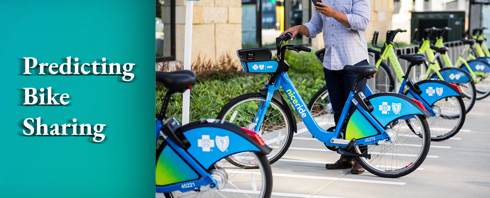
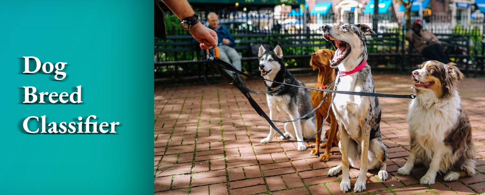
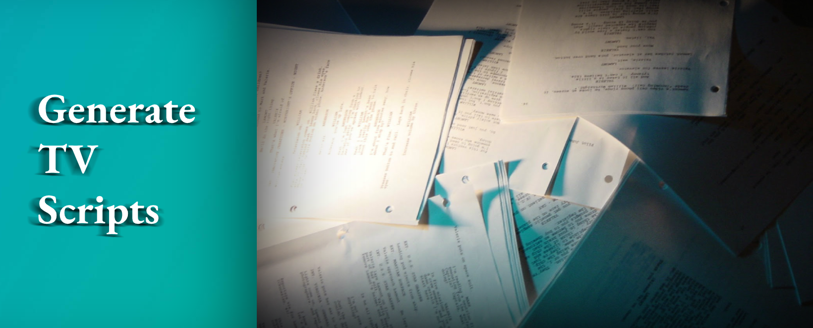
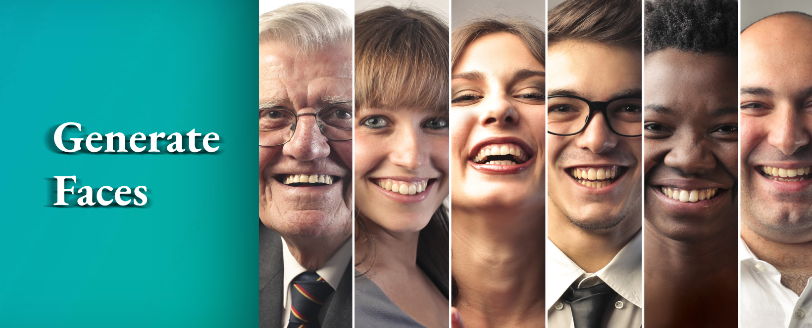
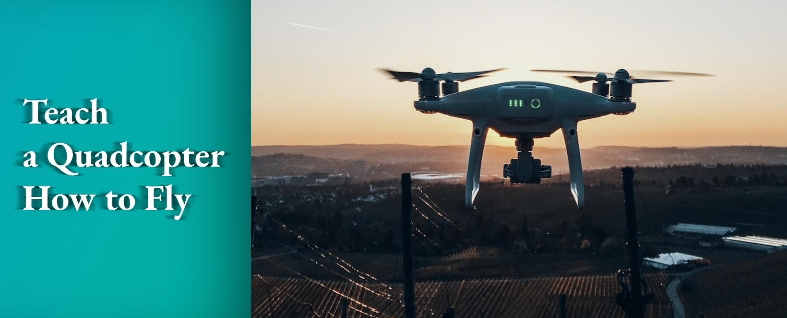
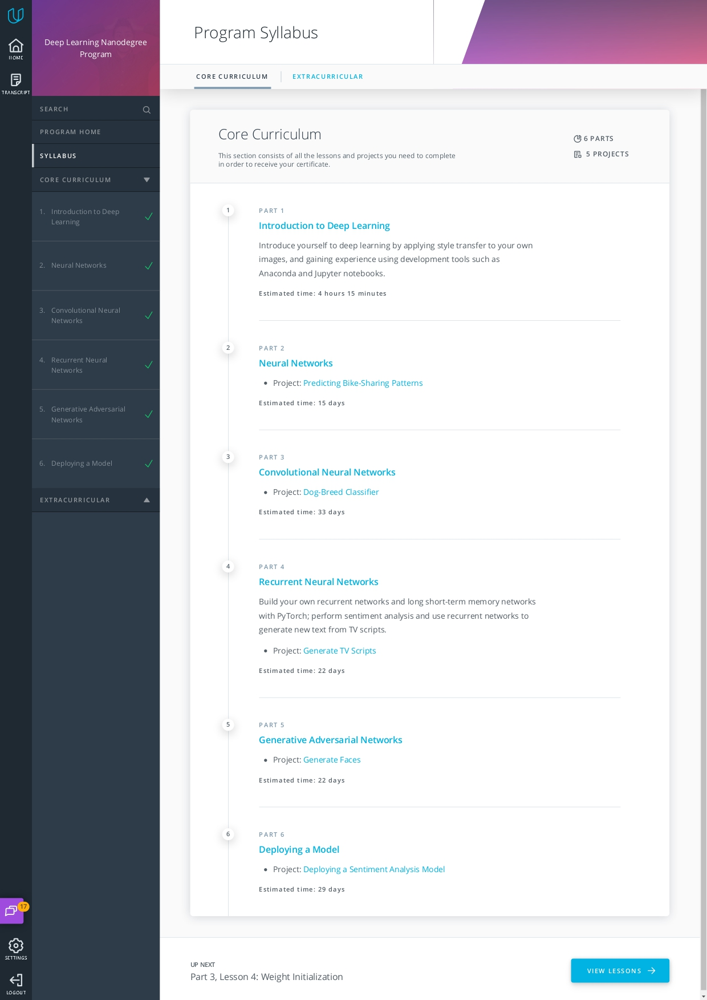
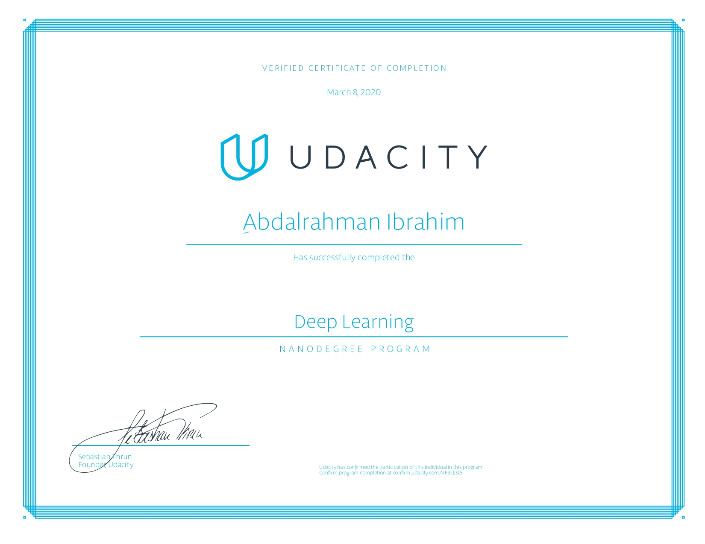

# Deep Learning Nanodegree 

## During this program I implemented the following projects:

## 1- Bike Sharing Prediction
I built a neural network to predict daily bike rental ridership.

## 2- Dog App
Built a pipeline to process real-world, user-supplied images. Given an image of a dog,
our algorithm will identify an estimate of the canines breed. If supplied an image of a human face, the
app will identify the resembling dog breed.

## 3- Generate TV Scripts
Generated my own Seinfeld TV scripts using RNNs. I used a Seinfeld dataset of scripts from 9 seasons.
The Neural Network I built generated a new, ”fake” TV script.

## 4- Face Generation
Used generative adversarial networks (GANs) to generate new images of faces.

## 5- AWS SageMaker deployment
Constructed a recurrent neural network for the purpose of determining the sentiment
of a movie review using the IMDB data set. I created this model using Amazon’s SageMaker service.
Deployed my model and construct a simple web app which interacts with the deployed
model.

## 6- Deep RL Quadcopter Controller
Designed an agent to fly a quadcopter and then train it using a reinforcement learning
algorithm.

## Content 

## Certificate 

